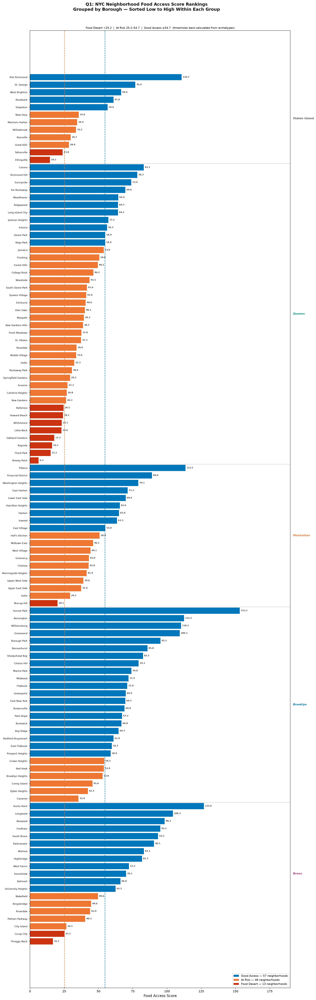
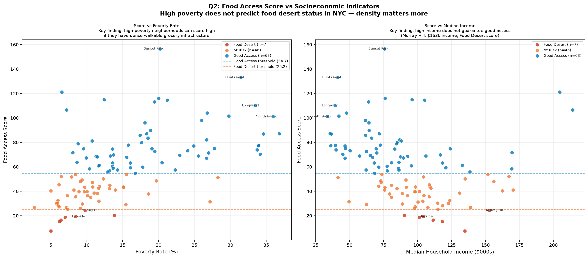
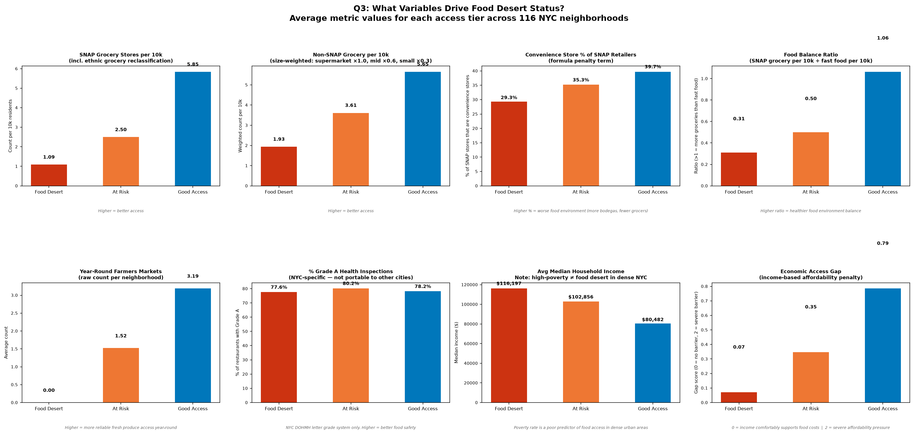
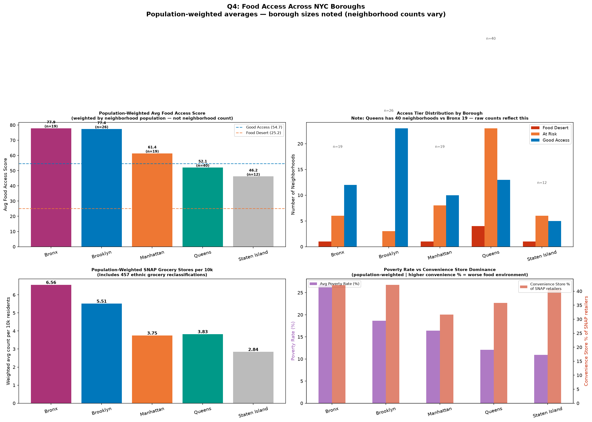

# NYC Food Desert Analysis

## Rethinking Food Access in New York City

The United States Department of Agriculture defines a food desert as any low-income census tract where a significant portion of residents live more than one mile from a supermarket. In a city where most residents travel by foot or subway, that definition misses the point entirely.

This analysis examines food access across **116 New York City neighborhoods** using a custom Food Access Score built from seven data sources. Rather than measuring distance to the nearest supermarket, it measures the density, quality, and affordability of the food retail environment — the factors that actually determine whether residents can access healthy food in an urban context.

---

## Key Findings

<div style="display:grid; grid-template-columns: repeat(3, 1fr); gap:16px; margin: 24px 0;">

<div style="background:#EDE6DC; border:1px solid #C4B49A; border-left: 4px solid #8B2C2C; border-radius:8px; padding:20px;">
  <div style="font-size:36px; font-weight:700; color:#8B2C2C;">7</div>
  <div style="font-size:14px; color:#4A3828; font-weight:600; margin-top:4px;">Food Desert Neighborhoods</div>
  <div style="font-size:12px; color:#6B5C48; margin-top:6px;">Score below 25.2 — critically low grocery access</div>
</div>

<div style="background:#EDE6DC; border:1px solid #C4B49A; border-left: 4px solid #C4851A; border-radius:8px; padding:20px;">
  <div style="font-size:36px; font-weight:700; color:#C4851A;">51</div>
  <div style="font-size:14px; color:#4A3828; font-weight:600; margin-top:4px;">At Risk Neighborhoods</div>
  <div style="font-size:12px; color:#6B5C48; margin-top:6px;">Score 25.2–54.7 — marginal access with measurable gaps</div>
</div>

<div style="background:#EDE6DC; border:1px solid #C4B49A; border-left: 4px solid #2B6B4A; border-radius:8px; padding:20px;">
  <div style="font-size:36px; font-weight:700; color:#2B6B4A;">58</div>
  <div style="font-size:14px; color:#4A3828; font-weight:600; margin-top:4px;">Good Access Neighborhoods</div>
  <div style="font-size:12px; color:#6B5C48; margin-top:6px;">Score above 54.7 — adequate grocery density and quality</div>
</div>

</div>

---

## Why the USDA Definition Falls Short

Distance-based food desert definitions were designed for rural and suburban contexts where car ownership is common and supermarkets are sparse. In New York City — where 55% of households have no car and residents walk to shop — proximity alone is an inadequate measure of food access.

A neighborhood with ten bodegas within walking distance is not food-secure simply because those bodegas are nearby. And a neighborhood where the only nearby grocery stores are priced beyond what residents can afford does not have good food access simply because stores exist.

This analysis measures what actually matters: how many authorized food retailers serve residents per capita, what proportion of those retailers sell healthy food, whether the food environment is balanced between grocery stores and fast food, and whether prices are accessible given local incomes.

---

## A Note on Methodology

This project uses the USDA SNAP retailer authorization database as its primary data source, which captures stores authorized to accept SNAP benefits. This intentionally anchors the analysis to the food access reality of low-income residents — the population most affected by food desert conditions.

457 ethnic grocery stores — halal markets, carnecerias, African grocers, produce markets — were reclassified from the USDA's generic "Convenience Store" category to healthy retail. These stores represent real food access infrastructure that standard classification systems systematically undercount.

Thresholds separating Food Desert, At Risk, and Good Access tiers are back-calculated from defined archetypes rather than chosen to produce a target distribution. A neighborhood's classification reflects its actual food access conditions, not its position in the citywide distribution.

---

## Data Sources

| Source | Records | Coverage |
|---|---|---|
| ACS 2023 5-Year Estimates | 173 ZIP codes | Population, income, poverty |
| USDA SNAP Retailer Locator | 8,457 stores | All authorized NYC retailers |
| NYC DOHMH Restaurant Inspections | 26,014 restaurants | Health grades, cuisine type |
| NYC DOHMH Farmers Markets | 1,362 markets | Location, EBT acceptance, seasonality |
| NY State Dept of Agriculture | 8,677 stores | All licensed food retailers |
| NYC Emergency Food Supply Gap | 197 NTAs | Food insecurity rates (2025) |
| NYC GreenThumb | 546 gardens | Active community gardens |

---

*Use the navigation to explore the methodology, findings, interactive map, and intervention analysis.*
EOF

cat > "/Users/philippe/Documents/Personal Projects/fooddesert/observable-site/src/methodology.md" << 'EOF'
# Methodology

## Overview

The Food Access Score is a composite metric designed to measure the quality, density, and affordability of the food retail environment in each NYC neighborhood. It is computed at the ZIP code level and aggregated to neighborhoods using a crosswalk of 173 ZIP codes mapped to 116 neighborhoods across all five boroughs.

---

## The Food Access Score

Each neighborhood receives a score based on ten weighted variables. Higher scores indicate better food access.

Food Access Score =
(snap_grocery_per_10k x 8.0) -- SNAP grocery store density

(nonsnap_grocery_per_10k x 5.0) -- Non-SNAP grocery access
(membership_per_10k x 3.0) -- Warehouse stores (partial credit)
(convenience_ratio / 100 x 8.0) -- Convenience store dominance (penalty)
(food_balance_ratio x 4.0) -- Grocery vs. fast food balance
(year_round_markets x 1.0) -- Reliable fresh produce access
(farmers_markets_per_10k x 0.5) -- Normalized market access
(gardens_per_10k x 0.25) -- Community garden access
(pct_grade_A / 100 x 0.2) -- Food quality signal
(economic_access_gap x 1.0) -- Affordability penalty

---

## Variable Definitions

**snap_grocery_per_10k** — SNAP-authorized grocery stores, supermarkets, and super stores per 10,000 residents. This is the single highest-weighted variable because it directly measures physical food access for the residents most at risk of food insecurity. Ethnic grocery stores reclassified from the USDA Convenience Store category are included here.

**nonsnap_grocery_per_10k** — All licensed food retailers not in the SNAP database, weighted by store size. Supermarkets receive full weight (x1.0), mid-size grocers receive partial weight (x0.6), and small stores receive minimal weight (x0.3). Lower weight than SNAP stores reflects that non-SNAP retailers are not universally accessible to all residents.

**membership_per_10k** — Warehouse and membership stores (Costco, BJ's) per 10,000 residents. Given the lowest weight among grocery terms because the membership fee represents a meaningful barrier for lower-income households.

**convenience_ratio** — The percentage of SNAP-authorized retailers classified as convenience stores. This is the strongest penalty term in the formula. A neighborhood where 70% of its SNAP retail options are bodegas and corner stores has a fundamentally different food access reality than one where 70% are grocery stores — even if total store counts are similar.

**food_balance_ratio** — SNAP grocery stores per 10k divided by fast food restaurants per 10k plus one. Values above 1.0 indicate more grocery options than fast food. This term captures balance rather than penalizing fast food outright — some fast food presence is normal and acceptable in a healthy food environment.

**year_round_markets** — Count of farmers markets operating year-round in the neighborhood. Seasonal markets are excluded because intermittent availability does not constitute reliable food access infrastructure.

**farmers_markets_per_10k** — Total farmers market locations per 10,000 residents, normalizing for neighborhood population size.

**gardens_per_10k** — Active GreenThumb community gardens per 10,000 residents. Weighted at 0.25 because not all registered gardens produce food accessible to the broader community.

**pct_grade_A** — Percentage of inspected food establishments with a New York City Department of Health Grade A rating. This variable is specific to NYC's letter-grade inspection system and is not portable to analyses of other cities.

**economic_access_gap** — An income-based affordability penalty ranging from 0 to 2. Neighborhoods with median household income above $100,000 receive no penalty (0.0). Neighborhoods below $35,000 receive the maximum penalty (2.0). This reflects the reality that physical proximity to food does not constitute access if residents cannot afford to shop there.

---

## Tier Classification

Access tiers are determined by back-calculating thresholds from defined archetypes rather than splitting the score distribution arbitrarily.

| Tier | Threshold | Neighborhoods |
|---|---|---|
| Food Desert | Score below 25.2 | 7 |
| At Risk | Score 25.2 to 54.7 | 51 |
| Good Access | Score 54.7 and above | 58 |

The Food Desert archetype represents a neighborhood with virtually no grocery infrastructure: 1.0 SNAP grocery stores per 10k, 65% convenience store ratio, no farmers markets, and a high affordability barrier. Plugging these values into the formula yields a score of approximately -0.9. The At Risk archetype yields approximately 21.5, and the Good Access archetype yields approximately 73.9. Tier thresholds are placed at the midpoints between adjacent archetypes.

---

## Ethnic Grocery Reclassification

The USDA SNAP retailer database classifies stores using a limited set of store type categories. Halal markets, carnecerias, African grocery stores, fish markets, and produce stands are frequently categorized as Convenience Stores despite selling primarily fresh and unprocessed food.

This analysis applies a name-based reclassification: any store whose name contains terms associated with ethnic food retail is reclassified to the healthy category regardless of its USDA designation. 457 stores were reclassified, representing 5.4% of the total NYC SNAP retailer database. The healthy retailer ratio increased from 45.8% to 46.6% citywide following this adjustment.

---

## Known Limitations

**SNAP data coverage** — The SNAP retailer database captures only stores authorized to accept SNAP benefits. High-end grocery retailers such as Whole Foods and specialty food stores are not included, which causes some high-income neighborhoods to score lower than intuition would suggest.

**Farmers market seasonal duplicates** — The DOHMH farmers market dataset lists some markets multiple times across seasons and years. The year_round_markets count is more reliable than total_farmers_markets for this reason.

**Community garden variability** — Not all GreenThumb-registered gardens produce food accessible to the community. The 0.25 weight reflects this uncertainty.

**Grade A inspection scores are NYC-specific** — The DOHMH letter grade system does not exist in most US cities. This variable contributes minimally to the score (weight 0.2) and would need to be replaced or removed for any adaptation of this methodology to another geography.

**Fast food identification** — Fast food establishments are identified from restaurant inspection records by cuisine description. This approach may undercount chains whose cuisine is listed generically.
EOF

cat > "/Users/philippe/Documents/Personal Projects/fooddesert/observable-site/src/findings.md" << 'EOF'
# Findings

## Research Questions

This analysis was structured around four research questions, each examined using the full dataset of 116 NYC neighborhoods.

---

## Q1: How do NYC neighborhoods rank on food access?

Neighborhoods are ranked by Food Access Score within each borough. The distribution reveals substantial variation both within and across boroughs, with the highest-scoring neighborhoods concentrated in dense, transit-rich areas and the lowest concentrated in lower-density, car-dependent outer neighborhoods.

The top-scoring neighborhoods — Sunset Park, Longwood, Hunts Point, Corona, and Jackson Heights — share a common profile: high population density, immigrant-heavy commercial corridors, and a large number of SNAP-authorized ethnic grocery stores per capita. The lowest-scoring neighborhoods — Breezy Point, Eltingville, Floral Park, Bayside, and Throggs Neck — are predominantly lower-density, outer-borough communities with sparse grocery infrastructure.



---

## Q2: Does poverty predict food desert status?

One of the most significant findings of this analysis is that poverty rate is a poor predictor of food access in New York City. Neighborhoods with the highest poverty rates — South Bronx, Longwood, Hunts Point — score well on food access because they have dense walkable grocery infrastructure. Neighborhoods with the lowest poverty rates — Bayside, Eltingville, Murray Hill — score poorly because they lack SNAP-authorized grocery density.

Murray Hill in Manhattan illustrates this paradox most clearly. With a median household income of $153,000, it scores as a Food Desert due to a near-absence of SNAP-authorized grocery stores. Residents in Murray Hill shop at non-SNAP specialty and gourmet retailers not captured by SNAP data, exposing a fundamental limitation of SNAP-based metrics in high-income urban neighborhoods.

This finding directly challenges the income-based criteria embedded in the USDA's food desert definition.



---

## Q3: What variables drive food desert classification?

Examining average metric values across the three access tiers reveals several important patterns.

Good Access neighborhoods have significantly higher SNAP grocery density per capita, reflecting the dominance of this term in the formula. The convenience store ratio is unexpectedly similar across tiers — this occurs because dense neighborhoods have more total SNAP retailers, and even a moderate proportion of convenience stores among a large total still yields a high absolute grocery count.

The poverty rate finding is counterintuitive but methodologically sound: high-poverty dense neighborhoods score well because poverty and grocery density are not negatively correlated in New York City. Dense immigrant neighborhoods have both high poverty rates and dense grocery infrastructure.

The economic access gap chart shows that Food Desert neighborhoods have lower affordability penalties on average — because most Food Desert neighborhoods are higher-income outer-borough communities where income is not the limiting factor. Access to food is limited by physical infrastructure, not purchasing power.



---

## Q4: How does food access vary across boroughs?

Borough-level analysis uses population-weighted averages to account for the fact that boroughs contain very different numbers of neighborhoods — Queens has 40 neighborhoods in this analysis while the Bronx has 19.

The Bronx scores highest on SNAP grocery density, driven by the concentration of ethnic grocery stores in neighborhoods like Fordham, Norwood, Highbridge, and University Heights. The ethnic grocery reclassification had a particularly strong effect in the Bronx, where 457 stores — many in dense immigrant commercial corridors — were moved from the Convenience Store category to healthy retail.

Queens shows the highest internal variation of any borough, spanning from some of the highest-scoring neighborhoods (Jackson Heights, Corona, Elmhurst) to five of the seven Food Desert neighborhoods (Bayside, Floral Park, Oakland Gardens, Whitestone, Howard Beach). This reflects the geographic diversity of Queens, which contains both dense immigrant neighborhoods and sprawling low-density communities.



---

## Summary

| Finding | Implication |
|---|---|
| Poverty rate does not predict food access | Income-based USDA criteria miss the most vulnerable urban neighborhoods |
| Dense immigrant neighborhoods score highest | Ethnic grocery infrastructure is systematically undercounted by standard classifications |
| High-income neighborhoods can score as Food Deserts | SNAP-only analysis misses boutique and specialty food retail |
| Queens has the most internal variation | Borough-level policy is too coarse — neighborhood-level targeting is necessary |
| 536 additional stores needed citywide | Full remediation to Good Access requires substantial sustained investment |
EOF

cat > "/Users/philippe/Documents/Personal Projects/fooddesert/observable-site/src/map.md" << 'EOF'
# Interactive Map

## Exploring Food Access Across NYC

The map below shows all 116 scored neighborhoods colored by access tier. Use the layer control in the top right to toggle between the neighborhood choropleth and the SNAP grocery store point layer.

**Neighborhood layer** — Click any neighborhood to see its full profile: food access score, tier classification, SNAP grocery density, healthy retailer ratio, convenience store percentage, year-round farmers markets, median income, poverty rate, and population.

**SNAP Grocery Store layer** — Individual dots represent every SNAP-authorized healthy retailer in NYC. Dot size varies by store type: larger dots indicate supermarkets, smaller dots indicate specialty stores and farmers markets. Color indicates store classification. Toggle this layer on to visualize the density argument directly — zoom into any Food Desert neighborhood and compare the visible store density to a Good Access neighborhood.

**Proposed Grocery Locations layer** — Star markers indicate recommended intervention locations for all 58 neighborhoods not yet at Good Access. Food Desert neighborhoods show a two-stage recommendation: stores needed to escape Food Desert status, and additional stores needed to reach Good Access. Click any marker for the full intervention analysis.

---

<div style="border:1px solid #C4B49A; border-radius:8px; overflow:hidden; margin: 24px 0;">

```html
<iframe
  src="./fooddesert_map.html"
  width="100%"
  height="700"
  style="border:none; display:block;"
  title="NYC Food Desert Interactive Map">
</iframe>
```

</div>

---

## Map Notes

**Color palette** — The map uses a colorblind-safe palette based on the Paul Tol color scheme. Food Desert neighborhoods appear in vermillion, At Risk in orange, and Good Access in blue. This palette is distinguishable by the three major forms of color vision deficiency.

**Neighborhood boundaries** — Boundaries are drawn from the NYC 2020 Neighborhood Tabulation Areas (NTAs) published by the Department of City Planning. Parks, cemeteries, airports, and other non-residential areas are shown in a neutral gray-green fill.

**Score thresholds** — Tier boundaries are at 25.2 (Food Desert / At Risk) and 54.7 (At Risk / Good Access). These values

cat > "/Users/philippe/Documents/Personal Projects/fooddesert/observable-site/src/intervention.md" << 'EOF'
# Intervention Analysis

## How Many Grocery Stores Does NYC Need?

This analysis estimates the number of additional SNAP-authorized grocery stores required for every underserved neighborhood to reach Good Access status. The calculation is based on the formula weight of the snap_grocery_per_10k term: each additional SNAP grocery store per 10,000 residents adds 8.0 points to a neighborhood's Food Access Score.

**536 additional SNAP-authorized grocery stores** are needed citywide for full remediation — bringing all 58 Food Desert and At Risk neighborhoods to Good Access status.

---

## Two-Stage Framework for Food Desert Neighborhoods

Food Desert neighborhoods receive a two-stage intervention estimate:

**Stage 1 — Escape Food Desert status** — the minimum number of stores needed to cross the At Risk threshold (score 25.2). This represents an achievable near-term target requiring a more modest investment.

**Stage 2 — Reach Good Access** — the total number of stores needed to reach full Good Access status (score 54.7). This is the longer-term remediation target.

At Risk neighborhoods receive a single estimate: stores needed to reach Good Access directly.

---

## Important Caveats

The store counts produced by this analysis are derived from a formula that holds all other variables constant. In practice, adding grocery stores to a neighborhood would also improve the food balance ratio (more groceries relative to fast food), potentially reduce the convenience store ratio as the retail mix shifts, and attract complementary food retail. The actual number of stores needed for full remediation is likely lower than these estimates suggest.

These recommendations should be understood as directional indicators of relative need, not precise policy targets. Neighborhoods with higher store counts needed require more substantial intervention — the relative ordering across neighborhoods is more meaningful than the absolute numbers.

Store placement within neighborhoods is shown at the geographic centroid of the neighborhood's ZIP code cluster. Optimal placement within a neighborhood would require street-network analysis and foot traffic data not available in this dataset.

---

## NYC's City-Owned Grocery Initiative

In 2024, New York City announced plans to open city-owned grocery stores in underserved neighborhoods. This analysis provides a data-driven framework for evaluating which neighborhoods should be prioritized and how many stores are needed to produce a measurable improvement in food access scores.

The seven Food Desert neighborhoods — Breezy Point, Eltingville, Floral Park, Bayside, Throggs Neck, Oakland Gardens, and Murray Hill — represent the highest priority for intervention. Among these, Throggs Neck (population 46,457, score 16.7) and Bayside (population 49,912, score 15.9) serve the largest populations with the greatest documented need.

Among At Risk neighborhoods, the highest-priority cases are those combining large populations with the most stores needed to reach Good Access. These represent communities where meaningful improvement is achievable but requires sustained investment.

---

## Explore on the Map

The Proposed Grocery Locations layer on the Map page shows intervention markers for all 58 underserved neighborhoods. Click any marker to see the two-stage recommendation for Food Desert neighborhoods or the single-stage recommendation for At Risk neighborhoods.
EOF